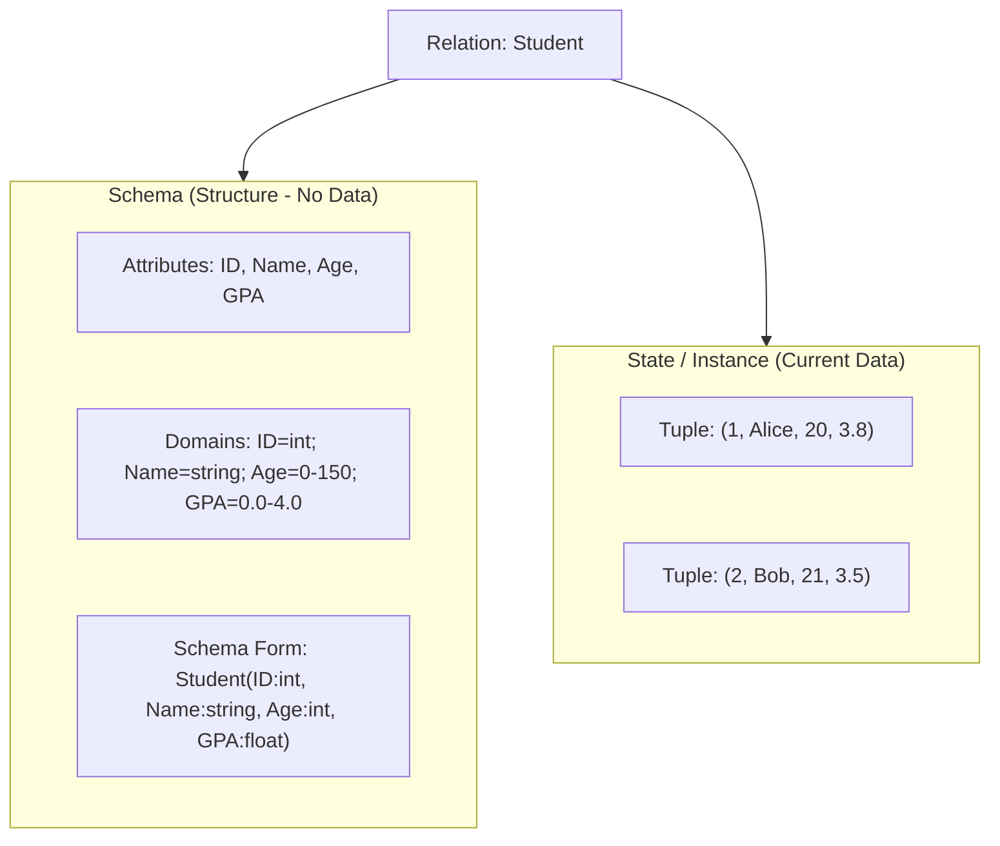
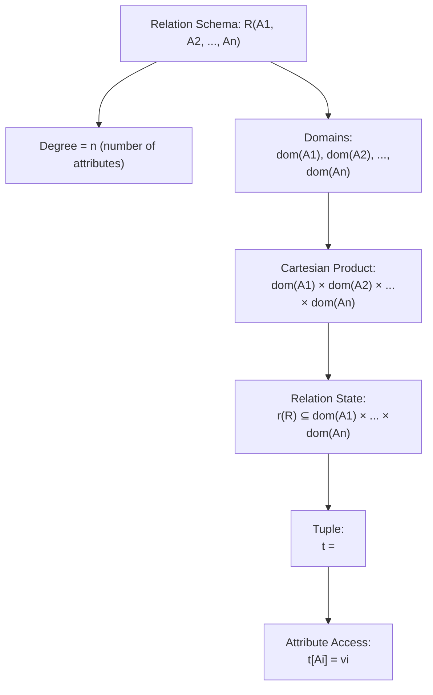
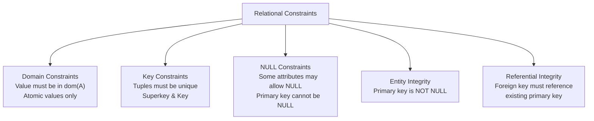
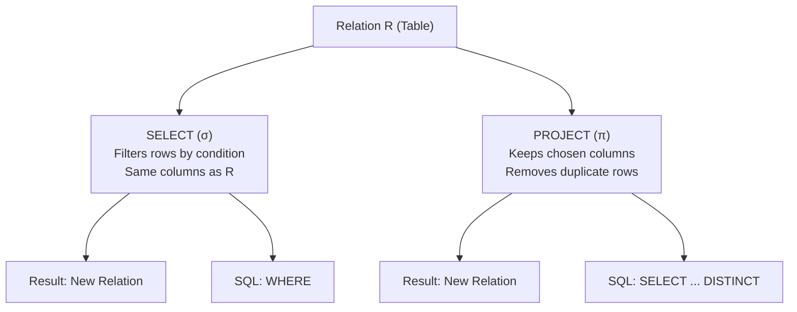

## Definition

1. 定义 Schema
2. 每个属性有 Domain
3. Domain 形成 Cartesian Product
4. State 是它的子集
5. State 由 tuples 构成
6. tuple 可以用 t[Ai] 访问

## Relational Constraints

## Example

![[Pasted image 20260213104335.png]]

## Relational Algebra Operations

|**Operation**|**Symbol**|**What it does**|**Changes Rows?**|**Changes Columns?**|**SQL Equivalent**|
|---|---|---|---|---|---|
|SELECT|σ|Filters tuples (rows) by condition|✅ Yes (≤ original)|❌ No|WHERE|
|PROJECT|π|Keeps only chosen attributes (columns)|⚠️ Maybe (duplicates removed)|✅ Yes|SELECT col1, col2 + DISTINCT|

