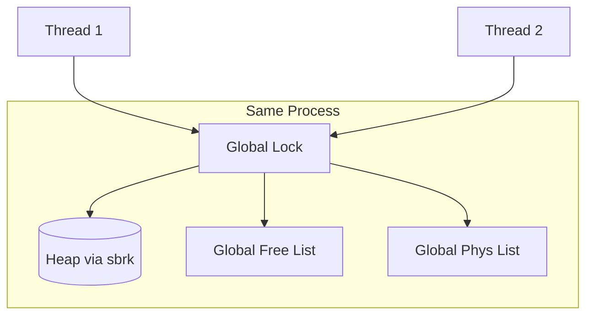
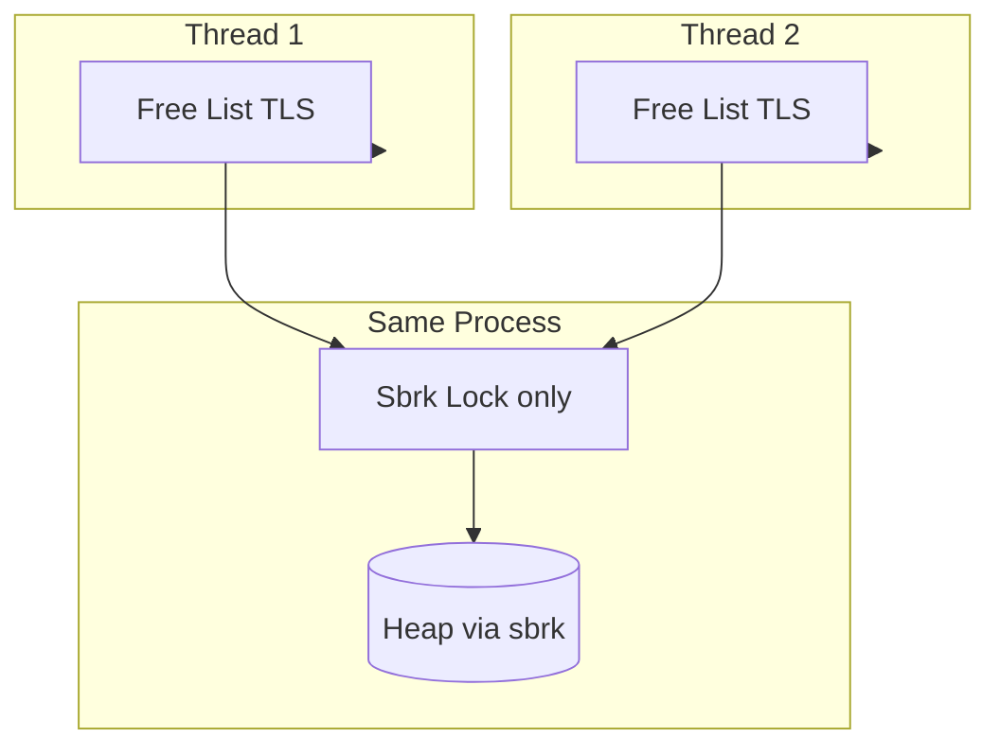

## Part 1 — Implementation Description
###  Version 1: Lock-Based Thread-Safe Malloc/Free
#### 1.1 Concurrency Model
The lock-based implementation uses a **single global mutex** to protect the entire allocator. 

Concurrency is therefore **not allowed inside the allocator**, but is allowed outside the allocator in the rest of the program.

#### 1.2 Critical Sections
The following operations were identified as critical sections because they modify shared allocator state:

- Traversing and updating the global free list (best-fit search, insertion, removal)
- Splitting blocks
- Coalescing blocks and updating physical neighbor links
- Calling `sbrk()` to extend the heap
- Updating global pointers such as the free list head and physical list tail

#### 1.3 Synchronization Strategy
A global mutex `malloc_lock` is acquired at the start of each allocator call and released at the end:

---

###  Version 2: Non-Locking Thread-Safe Malloc/Free

#### 2.1 Concurrency Model
The non-locking implementation is designed to allow concurrency across threads. The key idea is to avoid shared allocator metadata whenever possible.

- Each thread maintains its own free list using **Thread-Local Storage (TLS)**.
- Most malloc/free operations are performed on thread-private data, so they can run concurrently without locks.

The only shared operation is `sbrk()`, because the heap break is global and `sbrk()` is not thread-safe.

#### 2.2 Where Concurrency Is Allowed
This implementation allows concurrency in:

- best-fit search in a thread-local free list
- removing blocks from a thread-local free list
- inserting blocks into a thread-local free list
- splitting blocks in thread-local context

#### 2.3 Critical Section
The only critical section in the non-locking version is:

- calling `sbrk()` to extend the heap

If multiple threads call `sbrk()` simultaneously, they may receive overlapping memory regions. Therefore, `sbrk()` must be protected.

#### 2.4 Synchronization Strategy
A mutex `sbrk_lock` is used only around `sbrk()` calls:

---

##  Part 2 — Experimental Results
###  Results

| Version | Execution Time (s) | Data Segment Size (bytes) |
|--------:|--------------------:|--------------------------:|
| Non-locking | 0.095157 | 44,297,536 |
| Locking | 0.189614 | 43,910,832 |

---

### 3.3 Discussion of Tradeoffs

####  Performance (Execution Time)
The non-locking version was significantly faster:

- Non-locking: **0.095157 s**
- Locking: **0.189614 s**

The non-locking version is about **2× faster** in this experiment.

This is expected because the locking version serializes all allocator calls using a global mutex. With multiple threads frequently allocating and freeing memory, the lock becomes a bottleneck and forces threads to wait.

In contrast, the non-locking version allows multiple threads to allocate and free concurrently in most cases because each thread operates on its own free list.

---

#### 3.3.2 Allocation Efficiency (Data Segment Size)
The locking version produced a slightly smaller final heap size:

- Locking: **43,910,832 bytes**
- Non-locking: **44,297,536 bytes**

This indicates that the locking version was slightly more memory efficient in this run.

A likely explanation is that in the locking version, all threads share the same global free list. This means freed blocks are immediately available for reuse by any thread, improving reuse and reducing the need for heap expansion.

---

#### 3.3.3 Summary of Tradeoffs
Overall, the experiment demonstrates a classic tradeoff:

- **Locking version**
  - Pros: slightly better allocation efficiency, simple correctness reasoning
  - Cons: slower due to lock contention and serialized execution

- **Non-locking version**
  - Pros: much faster due to increased concurrency and reduced contention
  - Cons: slightly worse memory efficiency due to per-thread free lists and reduced cross-thread reuse

