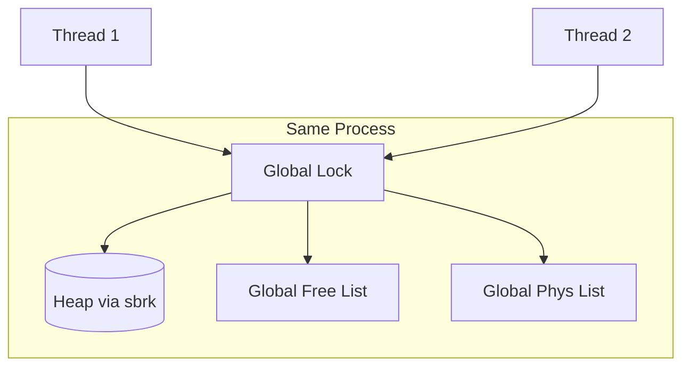
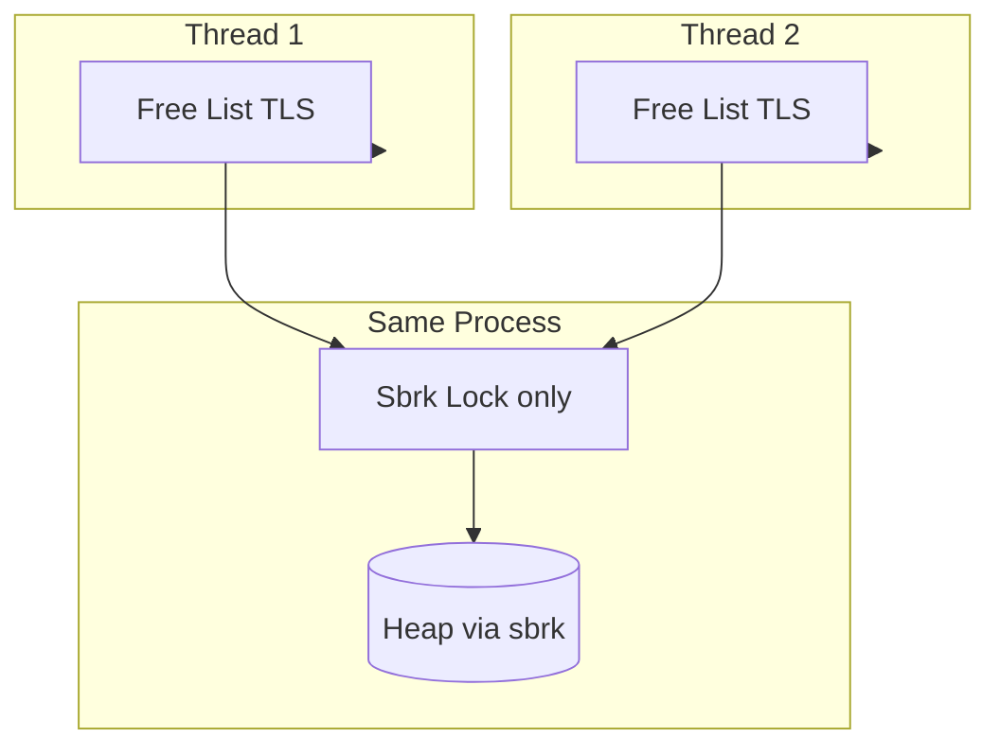

```mermaid
flowchart TB
  subgraph P[Same Process]
    H[(Heap via sbrk)]
    FL[Global Free List]
    PL[Global Phys List]
    L[Global Lock]
  end

  T1[Thread 1] --> L
  T2[Thread 2] --> L

  L --> FL
  L --> PL
  L --> H

```

```mermaid
flowchart TB
  subgraph P[Same Process]
    H[(Heap via sbrk)]
    SL[Sbrk Lock only]
  end

  subgraph T1[Thread 1]
    FL1[Free List TLS]
  end

  subgraph T2[Thread 2]
    FL2[Free List TLS]
  end

  T1 --> FL1
  T2 --> FL2

  FL1 --> SL
  FL2 --> SL

  SL --> H

```
