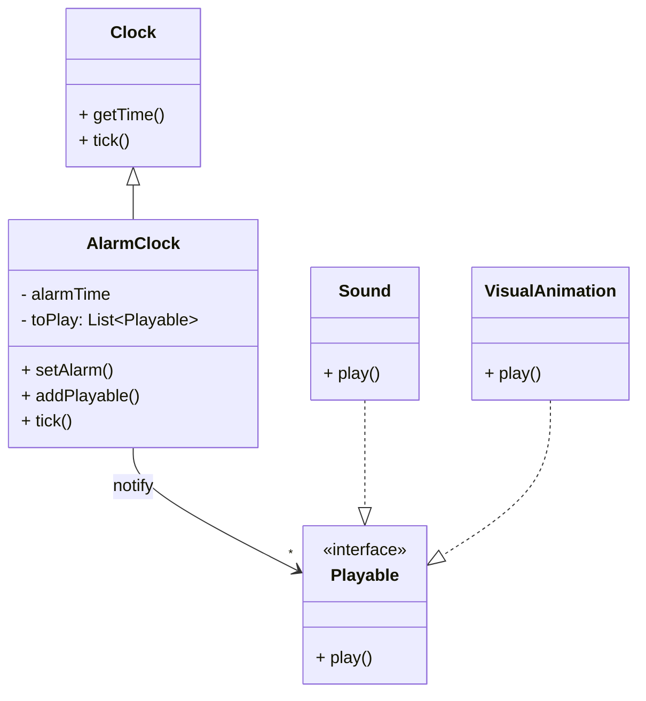
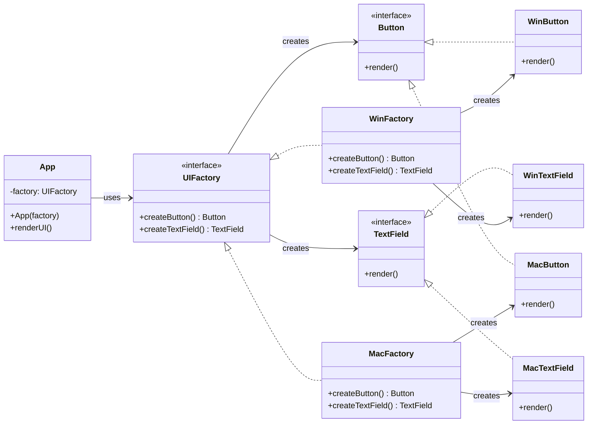
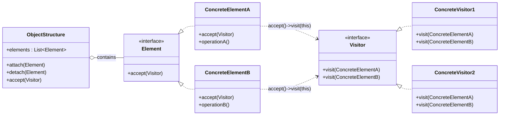
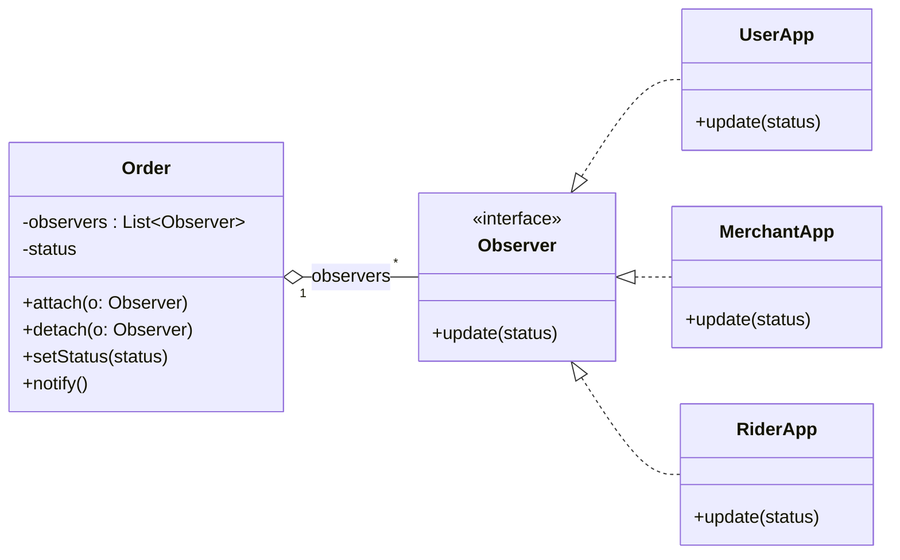

## Observer Pattern

解决违反 Open/Close 原则


![[8e49e981c89ce0c9e8e6720a121eb67f.jpg]]
## Adapter Pattern

解决违反Single Responsibility Principle

![[983d36bbaab7c9572a8051ef36de191b.jpg]]
## Abstract Factory


### 违反设计原则
#### 1 违反 DRY（Don't Repeat Yourself）

代码重复：

toybox.empty();  
toybox.add(t);

每个动物都写一遍。

如果逻辑变了，要改很多地方。

---

#### 2 违反 Open / Closed Principle

如果增加动物：

Tiger  
Monkey  
Elephant

就要修改：

AnimalEnclosure

即：

else if(animalType.equals("tiger")){ ... }

这违反：

Open for extension  
Closed for modification

---

#### 3 违反 Dependency Inversion

现在代码直接依赖：

Meat  
Fish  
Ball  
Ring

而不是依赖接口。

也就是：

high level class  
depends on  
low level classes


### ![[548a262bd77eb0bc655e9e93d4d2691f.jpg]]

## Singleton Pattern


```java
import java.io.FileWriter;
import java.io.PrintWriter;
import java.io.IOException;

public class BetterLogger {

    // 1. 唯一实例（static）
    private static BetterLogger logger = null;

    // 日志文件
    private final String logfile = "demo_better_log.txt";

    private PrintWriter writer;

    // 2. private 构造函数（禁止外部 new）
    private BetterLogger() {
        try {
            FileWriter fw = new FileWriter(logfile);
            writer = new PrintWriter(fw, true);
        } catch (IOException e) {
            e.printStackTrace();
        }
    }

    // 3. 获取唯一实例
    public static synchronized BetterLogger getInstance() {

        if (logger == null) {
            logger = new BetterLogger();
        }

        return logger;
    }

    // 4. 业务方法
    public void logWithdraw(String account, double amount) {
        writer.println("WITHDRAW (" + account + "): $" + amount);
    }

    public void logDeposit(String account, double amount) {
        writer.println("DEPOSIT (" + account + "): $" + amount);
    }

    public void logTransfer(String from, String to, double amount) {
        writer.println("TRANSFER (" + from + " -> " + to + "): $" + amount);
    }
}
```

### Singleton 三个核心结构（一定要记住）

### 1️⃣ static instance

private static BetterLogger logger;

保存唯一对象。

---

### 2️⃣ private constructor

private BetterLogger()

防止外部：

new BetterLogger()

---

### 3️⃣ getInstance()

public static BetterLogger getInstance()

提供唯一访问入口。

---

✅ **一句话记忆 Singleton：**

private constructor  
+ static instance  
+ static getInstance()
## Double Checked Locking

```java
public class GPU {

    private static volatile GPU obj = null;

    protected GPU() { }

    public static GPU getInstance() {

        if (obj == null) {

            synchronized (GPU.class) {

                if (obj == null) {
                    obj = detectGPUTypeAndCreate();
                }

            }

        }

        return obj;
    }
}
```
## Vistor Pattern







### 违反三个原则：

#### 1 SRP（Single Responsibility）

原来的类只负责：

城市数据

现在还负责：

XML导出

职责混乱。

---

#### 2 OCP（Open Closed Principle）

如果以后需要：

Export JSON  
Export CSV  
Export YAML

就要修改：

City  
Industry  
Sightseeing

违反：

对修改关闭

---

#### 3 Dependency Inversion

现在：

Node classes  
依赖  
XML代码

设计不好。

### ![[ed0971ef0ce0621ed0506a0c4e431ae2.jpg]]