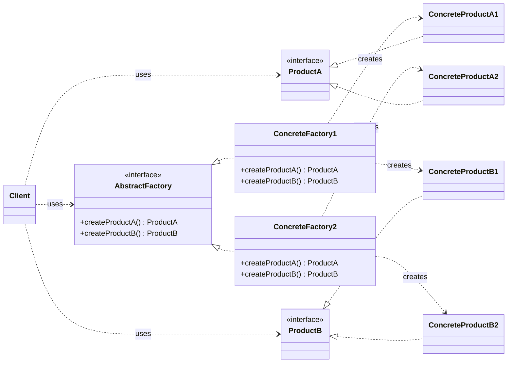
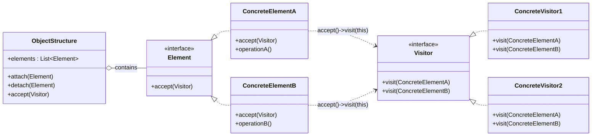

```mermaid
classDiagram
direction LR

class AbstractFactory {
  <<interface>>
  +createProductA() ProductA
  +createProductB() ProductB
}

class ConcreteFactory1 {
  +createProductA() ProductA
  +createProductB() ProductB
}

class ConcreteFactory2 {
  +createProductA() ProductA
  +createProductB() ProductB
}

AbstractFactory <|.. ConcreteFactory1
AbstractFactory <|.. ConcreteFactory2

class ProductA {
  <<interface>>
}
class ProductB {
  <<interface>>
}

class ConcreteProductA1
class ConcreteProductA2
class ConcreteProductB1
class ConcreteProductB2

ProductA <|.. ConcreteProductA1
ProductA <|.. ConcreteProductA2
ProductB <|.. ConcreteProductB1
ProductB <|.. ConcreteProductB2

ConcreteFactory1 ..> ConcreteProductA1 : creates
ConcreteFactory1 ..> ConcreteProductB1 : creates
ConcreteFactory2 ..> ConcreteProductA2 : creates
ConcreteFactory2 ..> ConcreteProductB2 : creates

class Client
Client ..> AbstractFactory : uses
Client ..> ProductA : uses
Client ..> ProductB : uses
```

## Vistor Parttern

```mermaid
classDiagram
    direction LR

    %% ===== Interfaces =====
    class Visitor {
        <<interface>>
        +visit(ConcreteElementA)
        +visit(ConcreteElementB)
    }

    class Element {
        <<interface>>
        +accept(Visitor)
    }

    %% ===== Concrete Elements =====
    class ConcreteElementA {
        +accept(Visitor)
        +operationA()
    }

    class ConcreteElementB {
        +accept(Visitor)
        +operationB()
    }

    %% ===== Concrete Visitors =====
    class ConcreteVisitor1 {
        +visit(ConcreteElementA)
        +visit(ConcreteElementB)
    }

    class ConcreteVisitor2 {
        +visit(ConcreteElementA)
        +visit(ConcreteElementB)
    }

    %% ===== Object Structure =====
    class ObjectStructure {
        +elements : List~Element~
        +attach(Element)
        +detach(Element)
        +accept(Visitor)
    }

    %% ===== Relationships =====
    Element <|.. ConcreteElementA
    Element <|.. ConcreteElementB

    Visitor <|.. ConcreteVisitor1
    Visitor <|.. ConcreteVisitor2

    ObjectStructure o-- Element : contains
    ConcreteElementA ..> Visitor : accept()->visit(this)
    ConcreteElementB ..> Visitor : accept()->visit(this)
```