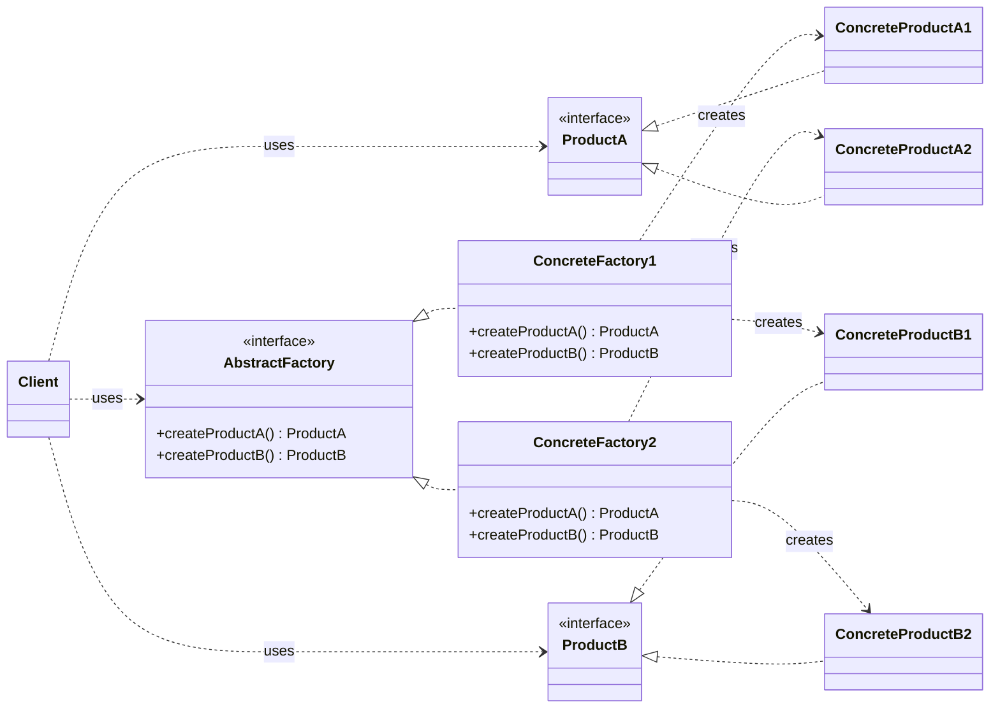

```mermaid
classDiagram
direction LR

class AbstractFactory {
  <<interface>>
  +createProductA() ProductA
  +createProductB() ProductB
}

class ConcreteFactory1 {
  +createProductA() ProductA
  +createProductB() ProductB
}

class ConcreteFactory2 {
  +createProductA() ProductA
  +createProductB() ProductB
}

AbstractFactory <|.. ConcreteFactory1
AbstractFactory <|.. ConcreteFactory2

class ProductA {
  <<interface>>
}
class ProductB {
  <<interface>>
}

class ConcreteProductA1
class ConcreteProductA2
class ConcreteProductB1
class ConcreteProductB2

ProductA <|.. ConcreteProductA1
ProductA <|.. ConcreteProductA2
ProductB <|.. ConcreteProductB1
ProductB <|.. ConcreteProductB2

ConcreteFactory1 ..> ConcreteProductA1 : creates
ConcreteFactory1 ..> ConcreteProductB1 : creates
ConcreteFactory2 ..> ConcreteProductA2 : creates
ConcreteFactory2 ..> ConcreteProductB2 : creates

class Client
Client ..> AbstractFactory : uses
Client ..> ProductA : uses
Client ..> ProductB : uses
```
