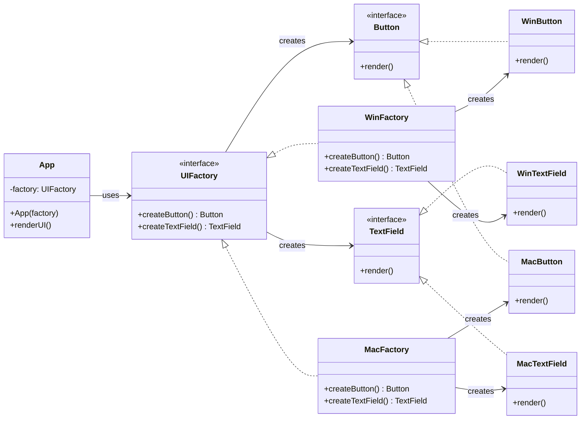
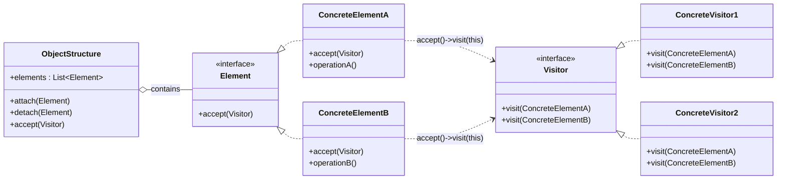
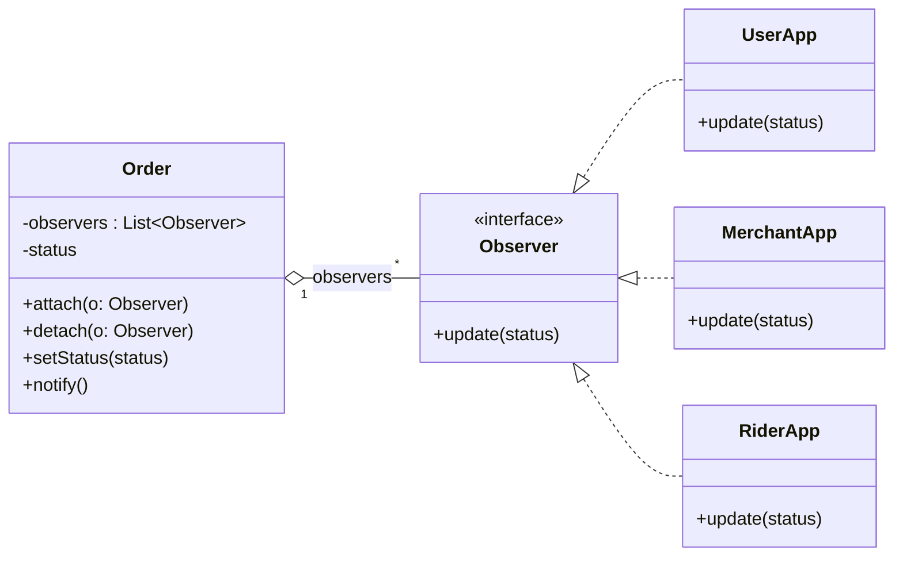

## Abstract Factory

```mermaid
classDiagram
direction LR

%% ===== 抽象产品 =====
class Button {
  <<interface>>
  +render()
}
class TextField {
  <<interface>>
  +render()
}

%% ===== 具体产品：Windows =====
class WinButton {
  +render()
}
class WinTextField {
  +render()
}
Button <|.. WinButton
TextField <|.. WinTextField

%% ===== 具体产品：macOS =====
class MacButton {
  +render()
}
class MacTextField {
  +render()
}
Button <|.. MacButton
TextField <|.. MacTextField

%% ===== 抽象工厂 =====
class UIFactory {
  <<interface>>
  +createButton() Button
  +createTextField() TextField
}

%% ===== 具体工厂 =====
class WinFactory {
  +createButton() Button
  +createTextField() TextField
}
class MacFactory {
  +createButton() Button
  +createTextField() TextField
}
UIFactory <|.. WinFactory
UIFactory <|.. MacFactory

%% ===== 客户端 =====
class App {
  -factory: UIFactory
  +App(factory)
  +renderUI()
}

App --> UIFactory : uses
UIFactory --> Button : creates
UIFactory --> TextField : creates
WinFactory --> WinButton : creates
WinFactory --> WinTextField : creates
MacFactory --> MacButton : creates
MacFactory --> MacTextField : creates
```

## Vistor Parttern

```mermaid
classDiagram
    direction LR

    %% ===== Interfaces =====
    class Visitor {
        <<interface>>
        +visit(ConcreteElementA)
        +visit(ConcreteElementB)
    }

    class Element {
        <<interface>>
        +accept(Visitor)
    }

    %% ===== Concrete Elements =====
    class ConcreteElementA {
        +accept(Visitor)
        +operationA()
    }

    class ConcreteElementB {
        +accept(Visitor)
        +operationB()
    }

    %% ===== Concrete Visitors =====
    class ConcreteVisitor1 {
        +visit(ConcreteElementA)
        +visit(ConcreteElementB)
    }

    class ConcreteVisitor2 {
        +visit(ConcreteElementA)
        +visit(ConcreteElementB)
    }

    %% ===== Object Structure =====
    class ObjectStructure {
        +elements : List~Element~
        +attach(Element)
        +detach(Element)
        +accept(Visitor)
    }

    %% ===== Relationships =====
    Element <|.. ConcreteElementA
    Element <|.. ConcreteElementB

    Visitor <|.. ConcreteVisitor1
    Visitor <|.. ConcreteVisitor2

    ObjectStructure o-- Element : contains
    ConcreteElementA ..> Visitor : accept()->visit(this)
    ConcreteElementB ..> Visitor : accept()->visit(this)
```

```mermaid
classDiagram
direction LR

class Order {
  -observers : List~Observer~
  -status
  +attach(o: Observer)
  +detach(o: Observer)
  +setStatus(status)
  +notify()
}

class Observer {
  <<interface>>
  +update(status)
}

class UserApp {
  +update(status)
}

class MerchantApp {
  +update(status)
}

class RiderApp {
  +update(status)
}

Order "1" o-- "*" Observer : observers
Observer <|.. UserApp
Observer <|.. MerchantApp
Observer <|.. RiderApp
```