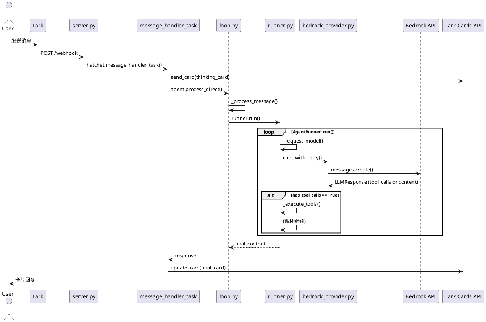
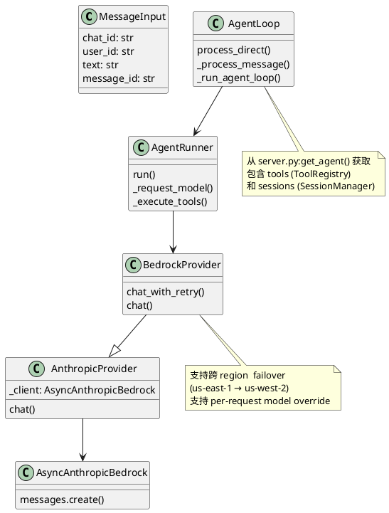

# 探索日志：Lark消息处理链路

## 问题
一个 Lark 消息从进入系统到返回卡片回复，经历了哪些步骤？

## 探索路径

| 序号 | 文件:函数 | 一句话核心逻辑 | 示例 |
|------|-----------|---------------|------|
| 1 | [server.py:message_handler_task](file:///Users/ihoo/intern/VisPie_backend/auto-amy/server.py#L299) | 入口：接收 Lark MessageInput，启动思考卡片，调度 agent | `input = MessageInput(chat_id, user_id, text, message_id)` |
| 2 | [loop.py:process_direct](file:///Users/ihoo/intern/VisPie_backend/auto-amy/nanobot/agent/loop.py#L768) | 构建 InboundMessage，调用 _process_message | `msg = InboundMessage(channel="lark", content=text)` |
| 3 | [loop.py:_process_message](file:///Users/ihoo/intern/VisPie_backend/auto-amy/nanobot/agent/loop.py#L514) | 预处理：slash命令分发、记忆注入、session管理 | `session = self.sessions.get_or_create(key)` |
| 4 | [loop.py:_run_agent_loop](file:///Users/ihoo/intern/VisPie_backend/auto-amy/nanobot/agent/loop.py#L338) | 包装 hook，调用 runner.run() | `self.runner.run(AgentRunSpec(...))` |
| 5 | [runner.py:run](file:///Users/ihoo/intern/VisPie_backend/auto-amy/nanobot/agent/runner.py#L79) | Agent迭代循环核心：LLM调用→工具执行→循环直到输出 | `for iteration in range(max_iterations): response = _request_model()` |
| 6 | [runner.py:_request_model](file:///Users/ihoo/intern/VisPie_backend/auto-amy/nanobot/agent/runner.py#L293) | 调用 provider.chat_with_retry 获取 LLM 响应 | `self.provider.chat_with_retry(**kwargs)` |
| 7 | [base.py:chat_with_retry](file:///Users/ihoo/intern/VisPie_backend/auto-amy/nanobot/providers/base.py#L458) | 带重试的 chat 调用，处理 transient 错误 | `return await self._run_with_retry(...)` |
| 8 | [anthropic_provider.py:chat](file:///Users/ihoo/intern/VisPie_backend/auto-amy/nanobot/providers/anthropic_provider.py#L463) | 构建 kwargs，调用 AWS Bedrock API | `response = await self._client.messages.create(**kwargs)` |

---

## 时序图



---

## 类依赖关系



---

## 关键数据流

```
入站消息:
Lark Message → MessageInput(chat_id, user_id, text, message_id)

出站卡片:
Thinking Card → Working Card → Final Card

Agent 内部消息格式:
[{"role": "system", "content": "..."},
 {"role": "user", "content": "帮我写一封邮件"},
 {"role": "assistant", "content": "", "tool_calls": [...]},
 {"role": "tool", "tool_call_id": "...", "content": "..."},
 {"role": "assistant", "content": "邮件已写好"}]
```

---

## Agent Loop 核心模式

```
while not has_final_response:
    1. _request_model() → LLM(messages)
    2. if has_tool_calls:
           results = _execute_tools(tool_calls)
           messages.append(assistant_msg + tool_results)
           continue  # 继续循环
       else:
           return content  # 最终回复
```

---

## 工具执行分支 (未深入)

runner.py:137 `_execute_tools()` 调用 ToolRegistry 执行具体工具（shell, filesystem, web, subagent 等），这是另一个可探索路径。

---

## 探索时间
2026-04-10
