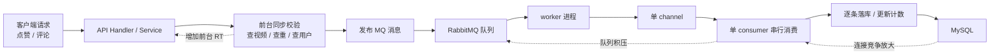
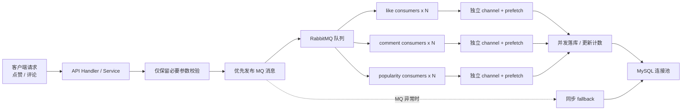

## 1.遇到什么问题（使用MQ后，p95延迟不降反升）？

```text
正常情况：
前台 Like() ──→ MQ ──→ 立即返回 OK
                ↓
            Worker 消费（异步，不影响前台）

积压情况：
前台 Like() ──→ MQ ──→ 立即返回 OK（MQ 发送不受影响）
                ↓
            Worker 消费（很慢）
                ↓
   ┌────────────┼────────────┐
   ↓            ↓            ↓
DB 连接池耗尽   CPU 打满    内存压力大
   ↓            ↓            ↓
   └────────────┴────────────┘
                ↓
        前台同步校验 IsLiked() 查询超时
```

“我在一个短视频 feed 系统里处理过一次比较典型的写链路性能问题。我在压测报告里看到一个很反常的现象：读接口已经优化得不错，但点赞和评论接口的 P95 接近 89 秒，这说明不是平均性能问题，而是严重长尾问题。

我当时没有直接改代码，而是先拆链路做分析。先对比 baseline 和优化版压测结果，确认问题主要集中在写接口；再去看服务层、MQ 发布路径和 worker 消费模型。最后定位到两个关键点：第一，所谓异步写接口其实前台还在同步查视频、查重、查用户，入口并不轻；第二，后台 worker 是单 channel、单 consumer 串行落库，高并发下队列和数据库一起积压，最终把前台 RT 也拖爆了。

基于这个判断，我没有做一次性大改，而是先做止血型改造：把 worker 改成多 channel、多 consumer 并发消费；把点赞查重、评论用户查询这类前台同步开销移出主路径；同时补上数据库连接池配置。这样做的目标很明确，不是一步到位，而是先把最灾难性的长尾打掉。

改完以后我重新跑了完整压测。结果很明显，点赞和评论接口的 P95 从接近 89 秒下降到了几秒到十几秒区间，说明方向是对的；读接口没有退化，部分指标还提升了。虽然高峰写场景下错误率和长尾还没有完全消失，但我已经把问题从‘系统级雪崩’收敛成了‘高压下仍需继续治理的资源竞争问题’。这件事我觉得最有价值的不是单纯把性能做快了，而是我能从压测现象出发，拆出原因链路，分阶段制定修复方案，再用复测结果证明改动有效。”

前台去掉同步重复校验，不等于重复点赞会被重复生效。我们只是把“是否重复”的判断从接口入口前移校验，改成了落库时的唯一键幂等控制。对同一个 user_id + video_id，数据库有联合唯一索引，消费端插入点赞记录时如果发现重复，就会直接吞掉，不会继续执行 likes_count + 1。所以后端真实点赞数不会被重复加。




## 2. 如何防止缓存击穿

面试官，我们项目视频详情页使用了Redis SETNX分布式锁来解决缓存击穿问题。

**问题背景**：热点视频的缓存过期瞬间，如果有1000个并发请求同时访问，会全部穿透到MySQL，数据库直接被打爆。

**解决思路**：我只允许1个请求回源MySQL，其他999个从缓存读取。

**具体实现**：我设计了4层逻辑。

**第1层**，先检查缓存，命中就直接返回，这能过滤掉90%的请求。

**第2层**，缓存未命中时，用SETNX尝试获取锁。SETNX是原子操作，只有key不存在才能设置成功，所以大量并发请求只有1个能抢到锁。

**第3层**，抢到锁的请求做双重检查，再看一下缓存有没有被其他协程回填，防止重复查询MySQL。确认没有后，回源MySQL构建缓存，然后释放锁。

**第4层**，没抢到锁的请求进入轮询等待，每20ms检查一次缓存，最多等100ms。一旦锁释放后缓存回填完成，这些请求就能读到缓存了。

**效果**：1000个并发请求，最终只有1个回源MySQL，其他999个从缓存读取，数据库压力降低了1000倍。

### 锁的key怎么设计的？

锁的key设计是 lock:video:detail:id=123 ，由两部分组成：

前缀 lock: + 缓存key video:detail:id=123

### 如何防止误删别人的锁？

Redis 分布式锁如果只用 `DEL key` 释放，会有误删问题。比如线程A拿到锁后发生长时间卡顿，导致锁过期；线程B随后拿到同一个锁；这时线程A恢复后执行 `DEL`，会把线程B持有的锁删掉，导致锁失效。解决方案是加锁时写入16 字节的随机字符串token，解锁时通过 Lua 脚本原子校验 value 是否是自己，再决定是否删除。


## 3.滑动窗口热榜算法怎么做

### 介绍一下你的热榜算法

"我设计了一个基于Redis Sorted Set的滑动窗口热榜。

核心是时间分桶：每分钟一个ZSet存储互动分数。写入时用ZINCRBY直接加到当前分钟桶。查询时用ZUNIONSTORE合并最近60分钟的桶分数，然后用ZREVRANGE取TOP N。

这个设计用空间换时间，实现了自然衰减和低延迟查询。"

### 怎么理解你的替代热度实时计算，将热榜计算压力从请求链路中剥离。

"这句话的核心是'计算前置'。传统做法是用户请求时实时算分数，压力大且延迟高。我改成写入时就分到当前分钟桶，查询时只需要合并几个桶的分数，把计算压力从请求时转移到写入时，实现了读写分离。"

